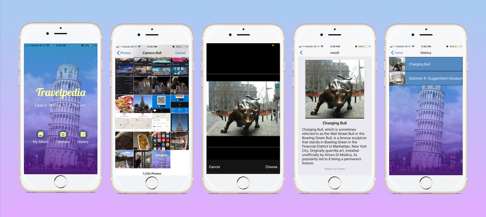

# Travelpedia
---
Travelpedia is a mobile app that allows Users to learn about historical architecture and landmarks through images on their phone. 

## Technology Used:
* React-Native 
* Redux
* Expo client
* Wikipedia API
* Google Cloud Vision API

This project was bootstrapped with [Create React Native App](https://github.com/react-community/create-react-native-app).

